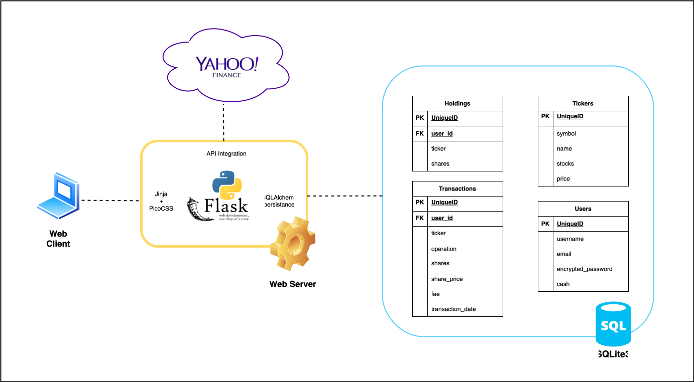

# Trading Wallet - Investment Portfolio Manager

Trading Wallet is a web application developed in Python using the Flask framework and a SQLite3 database to manage user profiles and investment portfolios.
Minimalist UI developed with PicoCSS.




https://trading-wallet-production.up.railway.app/

### Run

```bash
python -m venv .venv
. .venv/bin/activate
pip install --upgrade pip
pip install -r requirements.txt

export DEBUG="True"
export SQLALCHEMY_DATABASE_URI="sqlite:///trading-wallet.db"
export SECRET_KEY=$(python -c "import secrets; print(secrets.token_hex(16))")

python run.py
```

Go to http://127.0.0.1:5000/

## How to generate a secret with the python interpreter

```python
import secrets

secrets.token_hex(16)
```

## Features

- Register, login and logout
- Flash messages
- Form validations
- Encrypted passwords
- See and update account username, email, password and profile picture
- See all the stocks available in the market (integration with Yahoo Finance API)
- Buy stocks and sell your holdings
- Historical of transactions


## License

This project is licensed under the [Apache License 2.0](http://www.apache.org/licenses/LICENSE-2.0). See the LICENSE file for more details.


